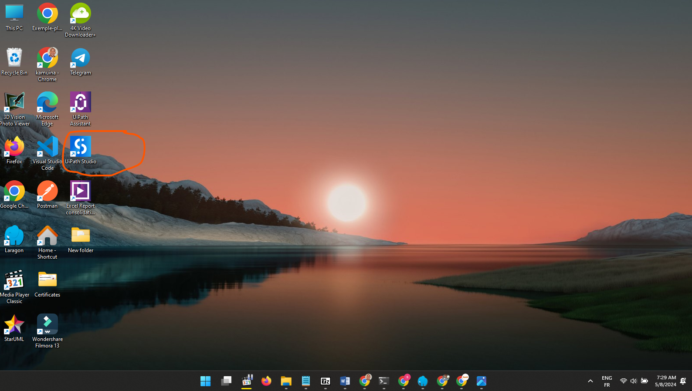
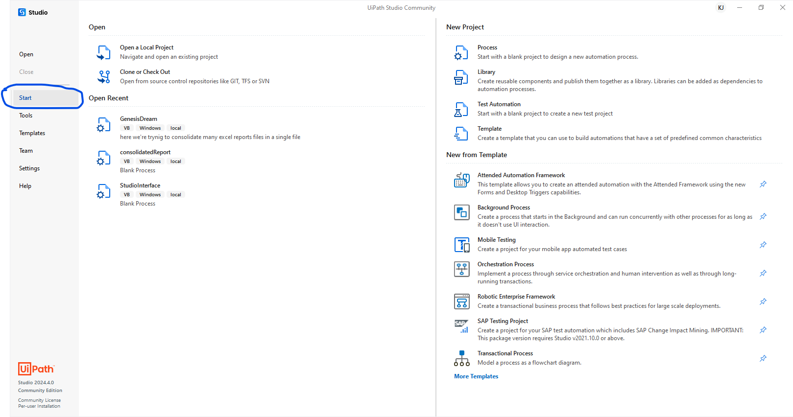
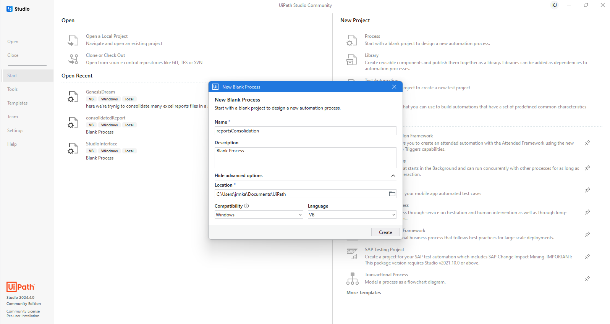
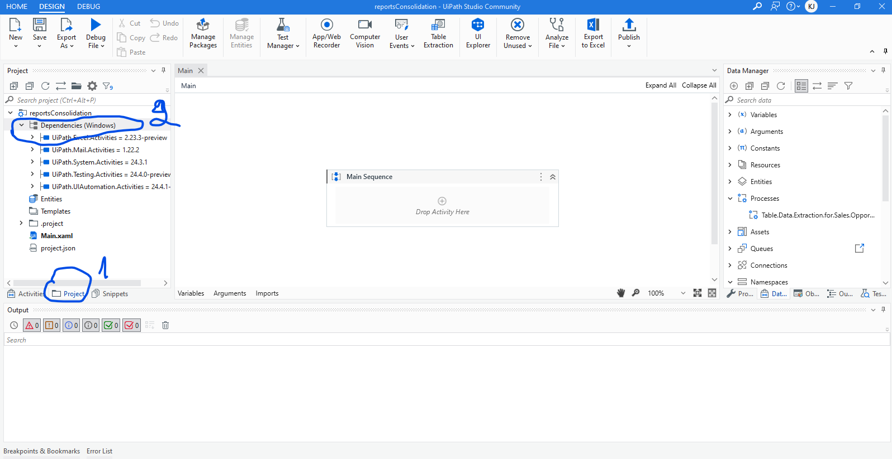
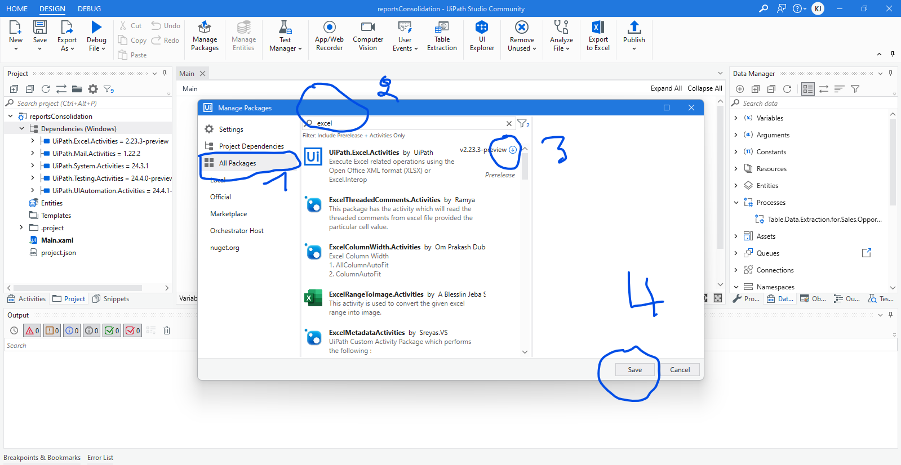
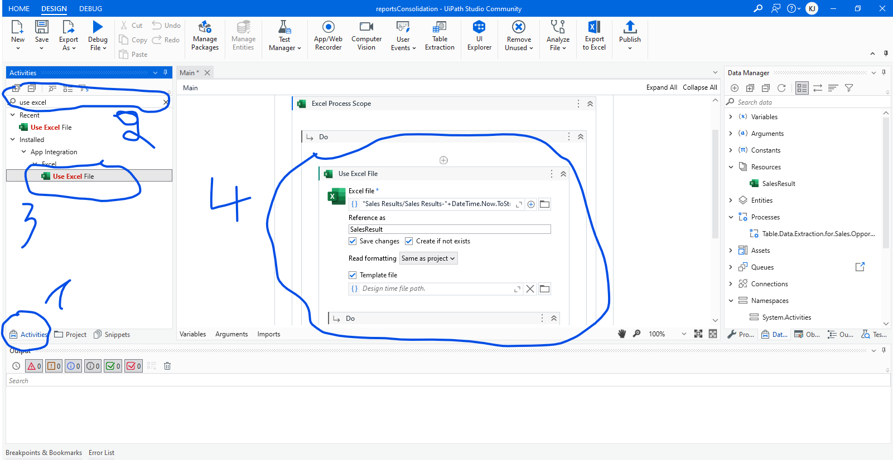
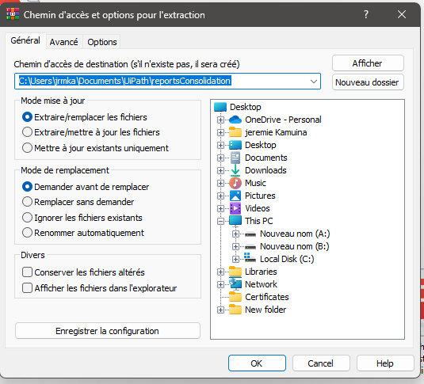

# Excel Report files consolidation Using UiPath Studio
This tutorial demonstrates step-by-step how to automate the consolidation of multiple Excel report files into a single Excel file using UiPath Studio.
<ul>
  <li><h4>Prerequisites</h4></li>
  <ul>
    <li>Install UiPath Studio here : https://docs.uipath.com/fr/studio/standalone/2022.10/user-guide/install-studio</li>
    <li>Install Excel if necessery here : <a href="https://www.microsoft.com/fr-fr/microsoft-365/buy/compare-all-microsoft-365-products?ranMID=46134&ranEAID=OBF6DmS860E&ranSiteID=OBF6DmS860E-iaTehZP_JnrvLZPLvsUItw&epi=OBF6DmS860E-iaTehZP_JnrvLZPLvsUItw&irgwc=1&OCID=AIDcmm549zy227_aff_7809_1243925&tduid=%28ir__cpynrpcyi0kfdjmgotgl6plsc22xdshzavo6atws00%29%287809%29%281243925%29%28OBF6DmS860E-iaTehZP_JnrvLZPLvsUItw%29%28%29&irclickid=_cpynrpcyi0kfdjmgotgl6plsc22xdshzavo6atws00">https://www.microsoft.com</a></li>
  </ul>
 

</ul>
 <ul>
    <li>Steps</li>
   <ol type="1">
     <li>Start Uipath Studio</li>
     
     <li>Click Start in the left menu</li>
     
      <li>Click Process in the right menu to start a new process</li>
     
     <li>Name your process</li>
     
     <b>Note:</b><i>You have the option to choose either VBA or C#, but in this tutorial, we will be using VBA as the programming language.</i>
      <li>In project tab, right click on Dependencies (Windows) and choose Manage</li>
     
     <li>Click All Packages tab</li>
     
     <li>Click Activities tab and search for Excel process scope in the search bar and notice the Main Sequence section in the center of the window</li>
     
     <li>Drag Excel Process Scope and drop ip in the Main Sequence to add the Process Scope activity</li>
     
     <li>Use a Excel file using use Excel file activity</li>
      <ul>
        <li>Search for Use Excel File activity in the Activity tab, drag and drop it into Excel Process Scope activity</li>
        <li>Name the Excel you will use as "Sales Results/Sales Results-"+DateTime.Now.ToString("yyyy-MM-dd")+".xlsx"</li>
        <li>Reference this file as SalesResult</li>
        <li>check template file</li>
      </ul>
     
     <li>Download the <a href="https://github.com/jrmkams/UiPathAutomation_1/blob/main/Daily%20Reports.rar">Daily Reports.rar</a></a> file</li></li>
     <li>Unzip the downloaded zip file in C:\Users\username\Documents\UiPath\reportsConsolidation  </li>
     <i>Note : Replace username by your computer username</i>
     
     <li>Create Sales Results folder  in C:\Users\username\Documents\UiPath\reportsConsolidation </li>
     
     
     <li>Write the sheet header cells</li>
     <li>Run the project</li>
     
     <ul>
       <li>Search for Write Cell activity, and drag and drop it into the Use Excel file activity</li>
        
       
       <li>Indicate the cell where to put the header</li>
       
     </ul>
   </ol>
</ul>
